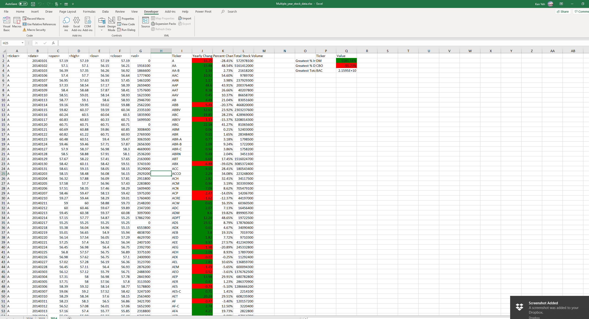
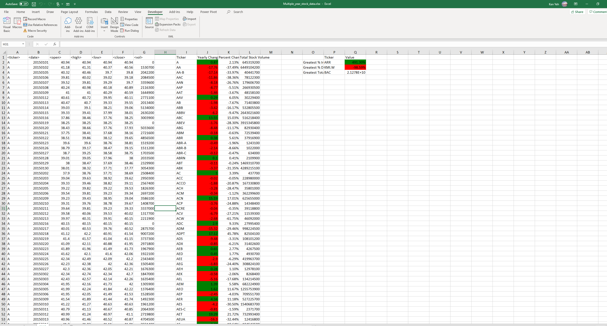
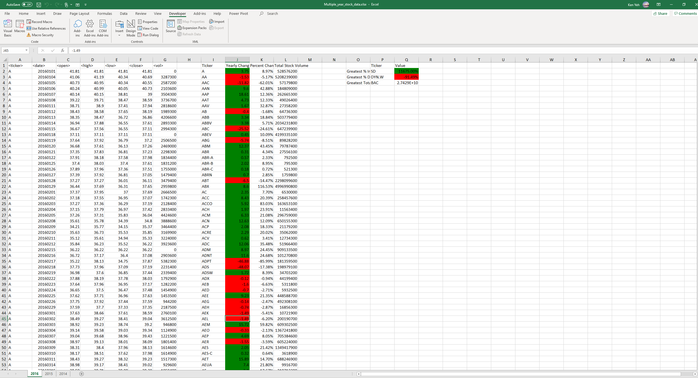

# VBA-Challenge
Used VBA to sort out stock data from 2014,2015, and 2016. Stock information is grouped by their ticker name and color coded by positive or negative yearly change. 
A summary table is on th left that shows the greatest percetnage incrase, greatest percentage decrease and greatest total volume.

Screenshot of formatted spreadsheet:

